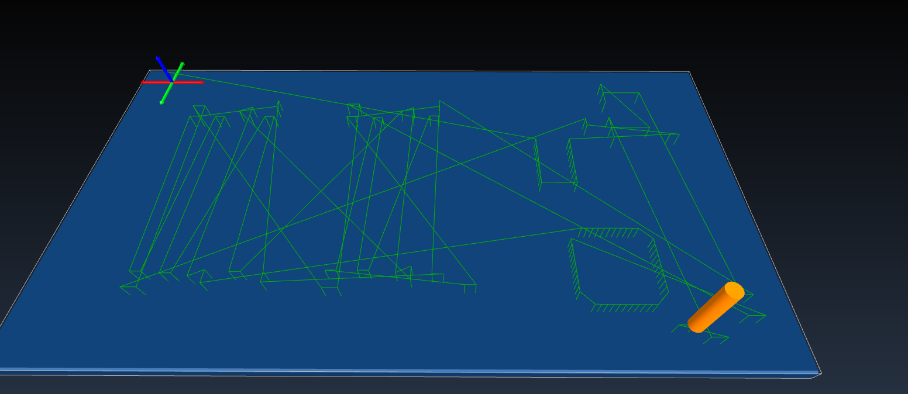

# KICAD CNC

### A library to convert pad and placement data from kicad to gcode for a solder paste dispenser and pick and place machine.

#### Latest Release: v0.1
This is new software and subject to bugs. Please submit bug reports via github so we can improve and debug for more stable code.

#### Usage:
```kicad_cnc inputfile outputfile.gcode command
```
As of v0.1 the only command you can enter is print. This prints the gcode to the screen.

#### Basic Premise
Kicad is a very good open source EDA and PCB design software. For small research based labs and companies populating boards by hand is becoming increaseingly more difficult, with the increase is SMD parts. However paying to have 3 or 4 prototype boards populated by external PCB production facilities is often much too expensive. The "middle" ground solution is to use a cnc pick and place / solder dispensing machine to populated both solder and parts. This software takes a kicad footprint report file, and finds the location of all pads and outputs gcode to send to a cnc solder paste dispenser. Unlike other codes an optimization routine is incorperated to decrease the amount of time and the amount of "shake" that is added to the process.

#### Optimization
Here is "plain" code:
This takes the data from a kicad board and outputs the pad positions.
It then writes Gcode to send to the CNC device.

As you can see however, the code it produces is random, and the machine must take large jumps between parts; something a human placing parts or solder by hand would not do! Below you will find an example of the optimize algorthim in this library. Once the code is optimized, the machine will compute the shortest path to process the entire board.

